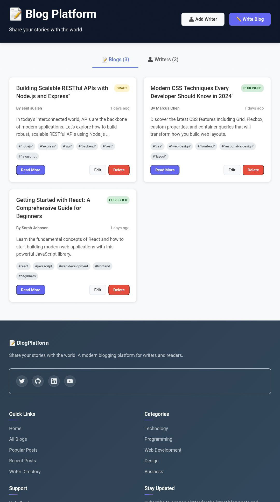
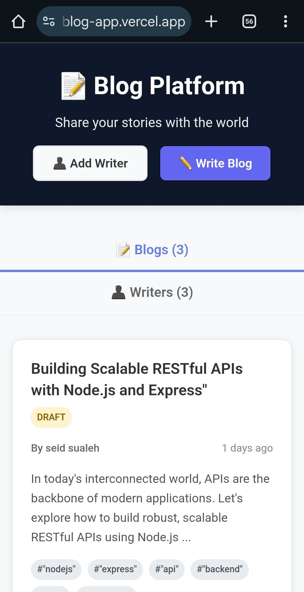

# My Blog (Frontend)

A modern, responsive frontend for a blogging application built with Vite and React. This repository contains the client-side code used to create, edit, list, and manage blog posts and writers. It is designed to be lightweight, easy to extend, and works with a separate backend API.

## Table of Contents

- Project Overview
- Features
- Tech Stack
- Getting Started
  - Prerequisites
  - Install
  - Run locally
  - Build for production
- Configuration
- Project Structure
- Contributing
- License

## Project Overview

This frontend implements the UI for a simple blog management system. It provides pages and components for listing blogs and writers, creating and editing blog posts and authors, and basic client-side form validation and feedback (loading states and modals).

## Features

- Create, read, update, and delete blog posts
- Manage writers (create, list, edit, delete)
- Client-side form validation and user feedback
- Reusable UI components (buttons, cards, modal, loading spinner)
- Clean, component-based code organized for easy extension

## Tech Stack

- Framework: React (with JSX)
- Bundler: Vite
- Styling: CSS modules / plain CSS per component
- Language: JavaScript (ESNext)

## Getting Started

### Prerequisites

- Node.js (LTS) and npm (or Yarn). Confirm you have them installed:

```bash
node -v
npm -v
```

### Install

From the `client/` directory, install dependencies:

```bash
cd client
npm install
```

If you prefer Yarn:

```bash
yarn
```

### Run locally

Start the development server with:

```bash
npm run dev
```

This runs the Vite dev server (hot reload). Open the URL shown in the terminal (usually `http://localhost:5173`).

### Build for production

Build a production bundle:

```bash
npm run build
```

Preview the production build locally:

```bash
npm run preview
```

## Configuration

- API base URL and client-specific configuration live in `src/utils/configs/api-config.js`. Update that file to point the client at your backend API.
- If you add environment variables for Vite, use `VITE_`-prefixed variables in a `.env` file and reference them via `import.meta.env.VITE_...`.

## Project Structure (important files)

- `index.html` — App entry HTML used by Vite
- `src/main.jsx` — App bootstrap and root render
- `src/App.jsx` — Top-level app component
- `src/pages/home/index.jsx` — Home page and layout
- `src/layouts/*` — Shared layout components (header, footer, home layout)
- `src/components/*` — Reusable UI components (button, card, modal, spinner)
- `src/service/blog/*` — Client API service functions for blogs and writers
- `src/utils/configs/api-config.js` — API configuration (base URL)
- `public/images/` — Static images served by Vite

## Placeholders

This project includes simple SVG placeholder images you can use to test responsiveness and layout during development. They live in the `public` folder so Vite will serve them directly.

- Desktop size: 


- Mobile size: 

There is a small demo section on the Home page titled **"Responsive image demo"** that shows both placeholders side-by-side. To view it:

```bash
cd client
npm install
npm run dev
# open the dev URL (usually http://localhost:5173) and go to the Home page
```

If you prefer to preview the images directly in the browser, open these URLs while the dev server is running:


## Contributing

Contributions are welcome. Suggested workflow:

1. Fork the repository and create a feature branch: `git checkout -b feat/your-feature`
2. Make small, focused commits with clear messages
3. Open a pull request describing the change and rationale

Guidelines:

- Keep UI and UX changes isolated to components when possible
- Run the dev server and verify there are no console errors before opening PRs

## Suggestions / Next Improvements

- Add unit and integration tests (Jest / React Testing Library)
- Add linting and pre-commit hooks (ESLint, Prettier, Husky)
- Add CI pipeline (GitHub Actions) for build and tests
- Add documentation for API contract and expected response shapes

## License

This project is provided under the MIT License. Replace with your preferred license if different.

---
